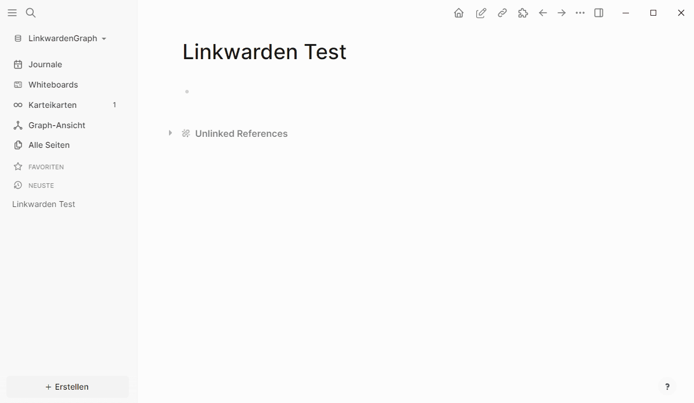

# Logseq Linkwarden Plugin

**Import links from your Linkwarden collection into Logseq as PDF. Keep track of your reading status and annotate important information.**

## Getting Started

Setup your connection to the Linkwarden API. You need to generate an Access Token/API Key from the Linkwarden instance.
Paste the base of the URL into Linkwarden Base URL. F.e. when running on localhost:3000, paste `http://localhost:3000` into the field.
Afterwards paste the Access Token/API Key into the Linkwarden API Key field.

To import links from Linkwarden, create a new block in Logseq, type in the collection name and add the tag `#linkwarden-collection`. If you click the button from the toolbar, the plugin will import all links from the collection. Header symbols f.e. `### <collection name> #linkwarden-collection` are also supported.

## Configuration

You can generate custom properties for every link. The properties are stored in the plugin
configuration. The default properties are:

    year:: ❓;status:: 🟦 Pending

You can also delete or change them.

Currently a custom link status is integrated. You can disable this extension if not needed.
Additionally you can also change the possible states. The default states are:

    🟦 Pending;🟥 Trashed;🟨 First Pass;🟩 Read;🟧 Archived

Feel free, to adapt them to your needs.

**Disclaimer: This project is not affiliated with Linkwarden. It is a personal project and not officially supported by Linkwarden.**